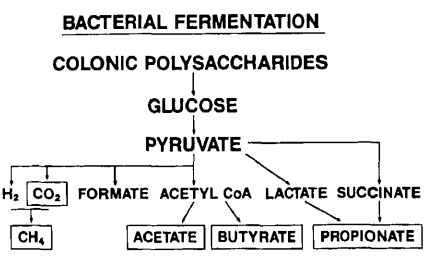

La *Mucina* constituye la secreción de las células *Globet* de las células epiteliales del intestino y el estómago, así como por las glándulas salivales. Está conformada principalmente por glucoproteínas que poseen en su estructura molecular *O*-Glucanos. Estos son polísacáridos ramificados compuestos principalmente por *N*-Acetilglucosamina, *N*-acetilgalactosamina (GlcNAc), galactosa y restos de fucosa, ácido siálico y carbohidratos azufrados.

Se han identificado dos aspectos de importancia fisiológica de la Mucina: en primer lugar, actúa como barrera protectora del epitelio intestinal y en segundo lugar, es un factor determinante de la homeóstasis entre el huésped y la microbiota intestinal. Si bien la Mucina es resistente al proceso digestivo en el intestino delgado, sirve de sustrato de fermentación en el colon.

Es conocido que las dietas ricas en fibra dietética y almidones resistentes, promueven la fermentación microbiana en el intestino y la síntesis de ácidos grasos de cadena corta (SCFAs por sus siglas en inglés). Estos promueven una variedad de funciones fisiológicas: pueden actuar como fuente de energía en las células del intestino, activan directamente los receptores celulares de proteína G (GPCRs), regulan la expresión de citoquinas en las células T y contribuyen a su regulación.

En animales de experimentación, se ha encontrado la presencia de SCFAs en concentraciones entre 30-60 mM, en ratas alimentadas con dietas ricas en fibra, así como animales alimentados con dietas libres de fibra dietaria, lo cual sugiere que los *O*-Glucanos de la Mucina pueden constituir una fuente de fibra endógena y una alternativa metabólica ante la ausencia de carbohidratos no digeribles de la dieta.

La evidencia científica indica que ante condiciones de ayuno moderado, los *O*-Glucanos de la Mucina promueven cambios en las poblaciones microbianas del microbioma intestinal humano, destacando la presencia de especies del género *Lachnospiraceae* *Bacteroides thetaiotaomicron* y *Akkermancia muciniphila*, microorganismos que sintetizan una variedad de enzimas involucradas en la hidrólisis de los *O*-Glucanos de la Mucina, *Anaerotruncus colihominis* y otras especies con los mecanismos enzimáticos capaces de utilizar la Mucina como sustrato energético, *R faecis* y otras especies productoras de ácido butírico (SCFAs) a partir de los *O*-Glucanos, lo cual sugiere que la utilización metabólica de la Mucina requiere la conformación de un consorcio bacteriano diverso. 

Los SCFAs: acetato, propionato y butirato están constituidos por 4-6 átomos de carbono y son la principal fuente de combustible de la mucosa del colon e impactan de manera positica la circulación mesentérica y la motilidad intestinal. Su ausencia está asociada con la atrofia de la mucosa colónica.

La síntesis de los SCFAs en las especies microbianas citadas con anterioridad, se produce por la ruta metabólica Embden-Meyerof de la glucólisis anaerobia.

{width=40}

La importancia de estos cambios en el microbioma intestinal, inducidos por periodos intermitentes de ayuno, radica en la producción de SCFAs y su influencia en la actividad inmunológica del cuerpo humano, tanto en la preservación de la homeóstasis intestinal como en su participación en el eje intestino-cerebro. Además de contribuir a regular la actividad celular de los Linfocitos T, los ácidos grasos de cadena corta y especialmente el Butirato, aceleran el metabolismo de los Linfocitos B y regulan la expresión genética que promueve la diferenciación de estas células.

### Referencias

* Hino S., Mizushima T., Kaneko K., Kawai E., Kondo T., Genda T., Yamada T., Hase K., Nishimura N., Morita T. Mucin-Derived *O*-Glycans Act as Endogenous Fiber and Sustain Mucosal Immune Homeostasis Via Short-Chain Fatty Acid Production in Rat Cecum. *Journal of Nutrition* (2020);150:2656-2665.

* Reilly K.J., Rombeau J.L. Metabolism and potencial clinical applications of short-chain fatty acids. *Clinical Nutrition* (1993); 12 (Suppl 1): S97-S105.

* Su J., Wang Y., Zhang X., Ma M., Xie Z., Pan Q., Ma Z., Peppelenbosch M.P. Remodeling of the gut microbiome during Ramadam-associated intermittent fasting. *American Journal of Clinical Nutrition* (2021);113:1332-1342.